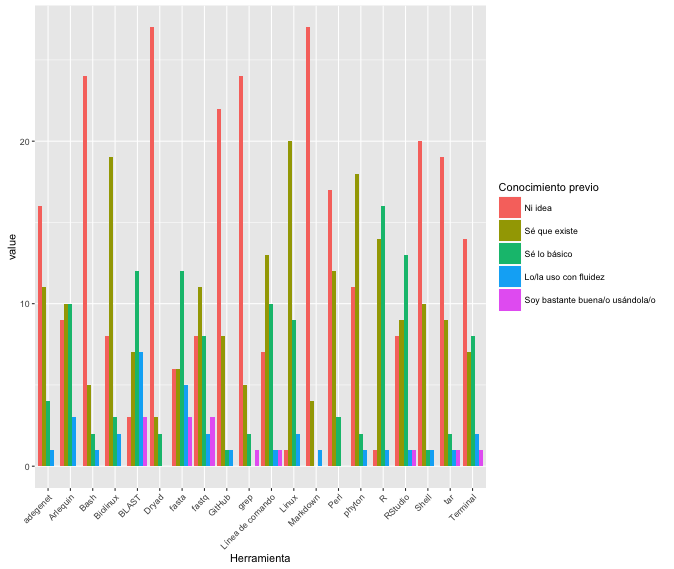
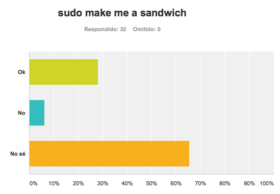
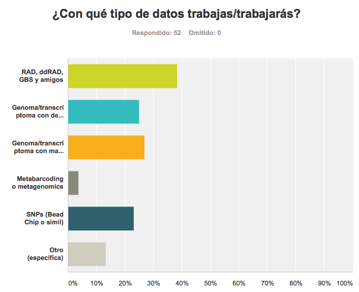
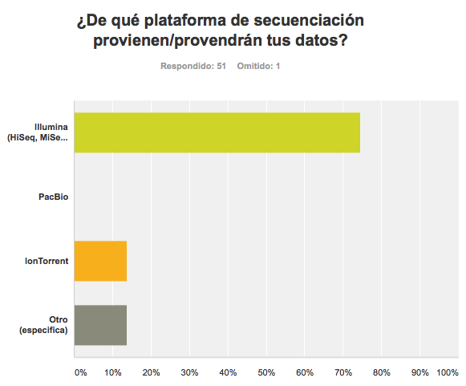
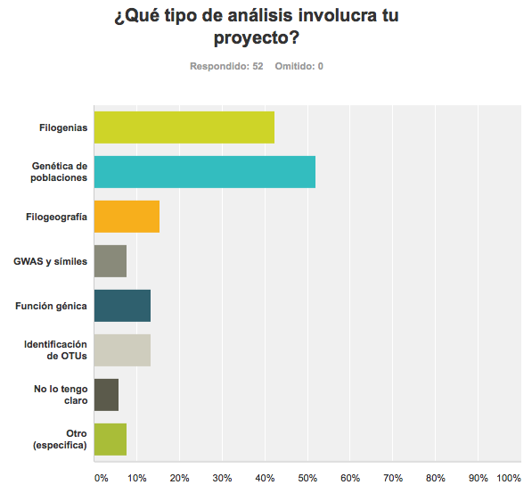
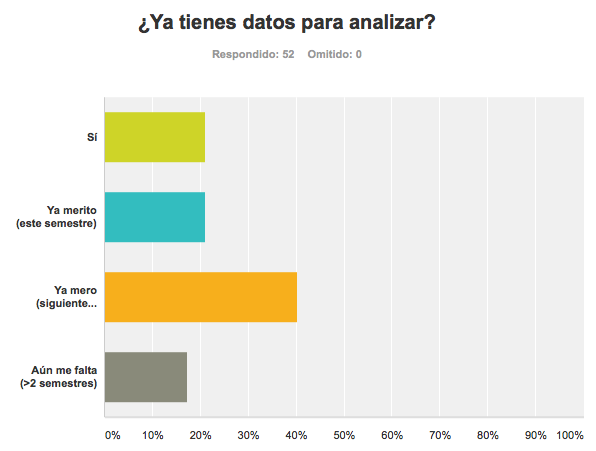
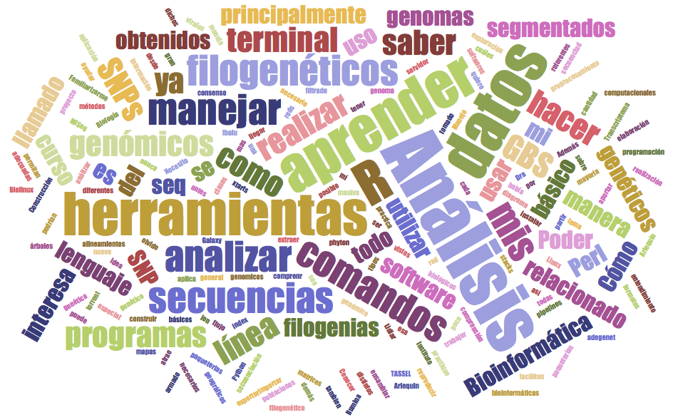
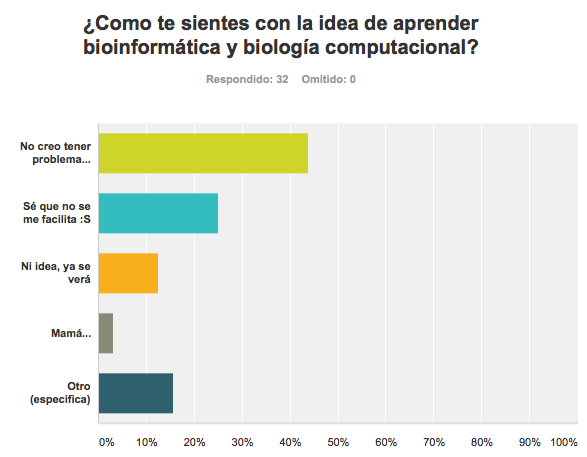

# Bienvenida

Quienes estudiamos biología y decidimos dedicarnos al estudio de la evolución, o cualquier tema que involucre datos genéticos, necesitamos utilizar herramientas de cómputo y lenguajes de programación. Sin embargo nuestros planes de estudio no contemplan esta formación y de algún modo se pretende que aprendamos por nosotras mismas lo que en otras carreras (matemáticas, ciencias de la computación y varios otros) es enseñado en varios semestres. 

Este fenómeno se extiende a través de universidades por todo el mundo. Una historia común es que los investigadores (sean estos asesore/as o estudiantes) deciden que tal o cual técnica de obtención de datos genómicos es ideal para responder tales o cuales preguntas biológicas, realizan el trabajo de laboratorio, una empresa les entrega los datos genómicos y luego pasa el tiempo sin que nadie sepa bien a bien cómo masticar los datos. O peor aún, los datos son analizados al *ahí se va*, están llenos de ruido que pudo haber sido filtrado y terminan en una publicación irreproducible y sin mucho significado biológico. En una versión un poco más feliz de la historia, una o un estudiante logra aprender sobre la marcha las herramientas que necesita y realiza los análisis. Meses después de lo planeado, pero lo logra. Historia feliz, salvo que esos meses después de lo planeado podrían haberse acortado significativamente con un poco de enseñanza formal y recomendaciones de que sí hacer y que no. 

Este curso pretende ser un primer paso para cerrar la brecha entre lo que nos es enseñado y lo que necesitamos para realizar nuestra investigación. Se trata de una introducción a los métodos y mejores prácticas de la biología computacional y los análisis bioinformáticos, o en otras palabras lo que me hubiera gustado que alguien me explicara cuando comencé a trabajar con datos genómicos.

A mi parecer aprender técnicas de biología computacional es igual que el trabajo de laboratorio: nunca he visto u oído que a los estudiantes sin experiencia alguna en el laboratorio se les mande a hacer una PCR sin antes capacitarlos en cosas tan simples como usar la centrífuga sin desbalancearla. Pero una vez que las bases están sentadas, depende de lo/as estudiantes seguir las mejores prácticas y aprender por nosotras mismas más allá de lo que se nos enseñó.

**Bienvenidas y bienvenidos**, ojalá que les sirva este curso.

## Dinámica del curso

### ¿Cómo serán las clases?
* Exposición + ejercicos y ejemplos en clase
* Todos los materiales de la clase los iremos subiendo a GitHub conforme avance el semestre
* Dejaremos **lecturas** a casa antes o después de algunos temas. Es una muy buena idea sí leerlas.

* **¿Necesito una computadora?** 
    * El curso es teórico-práctico, por lo que se requiere traigan su laptop a cada clase.

* Windows: 

  - Docker instalado y FUNCIONANDO o una partición de GNU/Linux
(para la tercera semana de clases)
   - Cygwin (https://www.cygwin.com) o una partición de GNU/Linux (para la segunda clase)

* Mac y GNU/Linux:

  -  Docker instalado y FUNCIONANDO (en estos SO ocuparemos Docker dentro de un mes)

* **¿Necesito instalar algo más? Sí**
     1. Un editor de texto decente. Listo para la 2da clase. Recomendaciones:
         * Windows: [Notepad++](https://notepad-plus-plus.org/)
         * Mac: [TextWrangler](http://download.cnet.com/TextWrangler/3000-2351_4-10220012.html) o [Fraise](http://www.macupdate.com/app/mac/33751/fraise)
         * GNU/Linux: [Gedit](http://sourceforge.net/projects/gedit/)
     2. Un editor de Markdown. Listo para la Unidad 6, mejor si desde antes. Recomendaciones:    
         * Windows: [Markdownpad](http://markdownpad.com/)
         * Mac: [MacDown](http://macdown.uranusjr.com/)
         * GNU/Linux: [Remarkable](http://remarkableapp.github.io/GNU/Linux/download.html)
     3. [R y RStudio](https://www.rstudio.com/products/rstudio/download/). Listos para la Unidad 7.

### Mecanismos de evaluación:
* **20% Exámenes parciales**    
    - 1ro: Unidades 1-3
    - 2do: Unidades 4-6

* **40% Tareas fuera del aula**
    - Más o menos una tarea por unidad. 
    - Se entregan en formato digital y no se reciben después de la fecha límite (salvo que me avisen **días antes** si su **trabajo de campo** interfiere con la entrega).

* **10% Participación en clase**
    - Pregunten, respondan, discutan.

* **30% Proyecto final con datos propios (si los tienes) o brindados por la profesora**
    - Individual.
    - Debe incluir temas vistos en las unidades 6 a 8
 

**Copiar o plagiar (tareas, exámenes, trabajo final, lo que sea) es motivo suficiente para reprobarte sin lugar a discusión**

## ¿De dónde empezamos?

Aquí algunos resultados del sondeo que les pedí contestaran:

El conocimiento con el que llegan:

La naturaleza de sus datos:

Sus expectativas del curso:

Cómo se sienten:

Ya veremos a donde llegamos.

